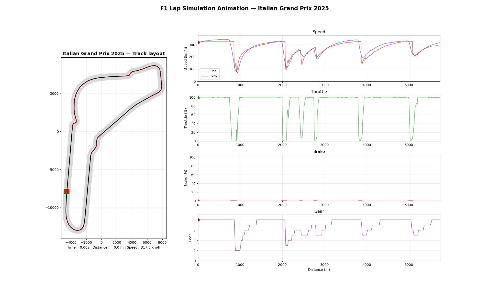

# F1 Lap Time Simulator (FastF1 + Physics)

> **Note**  
> *This project is a derivative of my friend [Raul Garcia](https://github.com/pmraulgarcia)’s great project. Please read his repo first:*  
> 👉 [The original repo](https://github.com/pmraulgarcia/Formula1_Race_Simulator)

This project is a lightweight F1 lap-time simulator that blends real telemetry (via [FastF1](https://docs.fastf1.dev/)) with a simple but realistic physics model.

It loads a session, extracts the fastest lap, discretizes the track into fixed-length segments, computes physics-based speed limits (aero + tyres + DRS + rev-limit), optimizes the velocity profile with forward/backward sweeps, and compares simulated vs. real speed & lap-time. Plots and an animated track view are included.

Typical match vs fastest-lap telemetry (after basic top-speed calibration): ~97–99% lap-time accuracy.

---

## Features (short)

- Robust telemetry merge (`merge_asof`), XY fill → stable curvature κ(s) and lateral-g.  
- Vehicle model: CdA/ClA, DRS multipliers, power-limited terminal speed, friction ellipse (accel/brake with lateral reservation), optional rev-cap and CdA retargeting to match vmax.  
- Track discretization: fixed-length segments (e.g., 6–10 m), score-based corner/straight labeling, radius per corner.  
- Lap optimizer: forward/backward sweeps to align brake points & exits.  
- Clean visuals (real vs sim overlay, cumulative time, acceleration) and a time-based animated track view.

---

## Installation

```bash
git clone https://github.com/Nahid-ahmdv/F1_LapTime_Simulator.git
cd F1_LapTime_Simulator
pip install -r requirements.txt
```

> Requires Python 3.10+. For MP4 animation export, install ffmpeg (GIF uses Pillow).
---

## Quick start

Enable the FastF1 cache once in your session:

```bash
import fastf1
fastf1.Cache.enable_cache("f1_cache")
```
Notebook: open `LapSim.ipynb` and run all.
Script: run your main script after setting this block at the bottom to choose a session:

```bash
year = 2025
round_no = 16
gp_name = 'Italian Grand Prix' # must match FastF1 EventName
session_type = "Q" # "R", "Q", "FP1", ...
segment_length = 10 # 6–10 m typical
create_animation = True
save_animation = True
```

(Tip: to list valid event names/rounds: `fastf1.get_event_schedule(year)`.)
(If you need more detailed explanations for any part of the code, see the `LapSim_explained` file.)
---

## What the code does (very short)

- Load & prep telemetry (`CircuitData`): merge car + XY (nearest-time), fill XY, compute κ(s) and lateral-g.  
- Discretize (`TrackDiscretization`): fixed-length bins; score → corner/straight; radius and DRS per segment.  
- Speed limits (`PhysicsLimits`): corners → max corner speed; straights → terminal speed (DRS-aware, optional rev-cap).  
- Optimize (`LapTimeOptimizer`): forward/backward sweeps with friction ellipse; store optimized_speed and per-segment time.  
- Lap-time: project sim speeds to real Distance grid and integrate $dt = ds/v$; optional upshift penalty.  
- Plots/animation: real vs sim overlay (MAE/RMSE), cumulative time, acceleration, sectors; time-based animated lap.

---

## Output

- Figure: real vs sim speed (same distance axis), limits vs profile, cumulative time, longitudinal accel, sector times.  
- Animation: track layout with moving marker + scrolling telemetry pointers.  
- Summary (console): real vs simulated lap-time, delta, accuracy, speed stats.


Example summary: 

```bash
📊 Circuit Statistics:
Circuit: Italian Grand Prix 2025 FP1
 Track Length: 5737 meters
 Fastest Lap: 80.117 seconds
 Driver: HAM
 Max Speed: 344.0 km/h

LAP TIMES:
 Real: 80.117 s
 Simulated: 79.924 s
 Difference: -0.193 s
 Accuracy: 99.8%
```

<p align="center">
  
</p>
---

**Thanks for reading and I hope you find this helpful!**
 
---

